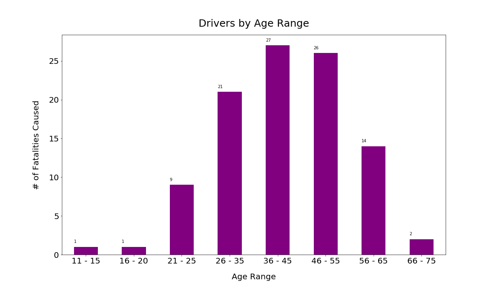

# Cycling: How to Beat Collision Statistics

## Introduction

The importance of maintaining a healthy lifestyle, both physically and mentally, has been at the forefront for many people. In turn, people have been using cycling as a method of transportation, to not only maintain a healthy lifestyle, but from an economical and environmental perspective as well. There are inherent risks involved with cycling and safety is of utmost concern for cyclists. 

Our team is comprised of three upcoming data analysts who have worked in unification to identify characteristics and conditions that may impact cycling safety, analyze potential conditions and find any relationship within the data. Lastly, we have applied this by using findings to promote safer cycling conditions for all cyclists, both current and upcoming. 

## Project Summary: Questions and Assumptions

Our aim of this project was ascertain the following questions and made the associated assumptions:
1. What are the most common characteristics of cyclists involved in fatal collisions?
    * Cyclists involved in collisions occurred at a higher rate in males between the ages of 20-30 years.

2. What are the characteristics of other parties involved in fatal cycling collisions?
    * Other parties involved in collisions occurred at a higher rate in females between the ages of 40-50 years. 

3. What are external characteristics that influence fatal cycling collisions?
    * External characteristics, such as night-time and wet-roads, increased the risk of cycling collisions. 

## Analysis

Upon granted request, data was obtained through a valid API key from CycleStreets API (v2), which is a modern JSON interface to the routing engine and other CycleStreets Components. This enabled us to create a script obtaining 28,000+ rows of data. 

**Central London:** Pulled data and created plots to showcase general cycling collision data. 
* [Map of all collisions from 1999 to 2021 in Central London](./output_data/images/map1_London_bokeh_plot.png)
* [Time Series: Number of total casualties from 1999 to 2021](./output_data/images/fig0.1_Casualties_all_years.png)
* [Frequency of casualties in 2021](./output_data/images/freq_fatal_2021t.png)
* [Total of each severity type from 1999 to 2021](./output_data/images/total_severity_types.png)
* [Total casualties by month from 1999 to 2021](./output_data/images/fig3.1_total_casualties_by_month.png)
* Types of overall casualities
* [Map of fatal collisions in Central London](./output_data/images/map2_London_fatal_bokeh_plot.png)

**Fatal Collisions:** Created plots to explore the relationships between fatal cycling collisions and the cyclists, other parties and external conditions.

Cyclist: Sex and age

Other Parties: Sex and age 

External Conditions: Speed limit, road type, weather condition, light condition, road surface condition

## Summary and Key Insights

Overall, what does the data tell us:

**Cyclists:**
* Male cyclists are at a slightly increased risk
* Cyclists aged 26-35 years are at an increased risk
* Cyclists are likely commuters, who are part of the working class

**Drivers:**
* Majority of drivers involved in fatal cycling collisions are male
* Drivers between the ages 36-55 years are more likely involved in fatal cyclist collisions
* Female drivers might be more cautous than their male counterparts 

**External Characteristics:**
* Most fatalitis take place on a dry surface, in a 30 mph single carriageway, with clear weather and ample daylight

## Limitations

The following are limitations within the dataset:
* Selecting boundaries of Central London
* Inconsistent data reporting, bias and human error

## Next Steps: Application

How to make drivers and cyclists more aware?

**Cyclists:**
* Infrastructure: Cycling lanes with diviers
* Education: Safer routes

**Drivers:**
* Signage: Speed limit feedback signs, hazard signs
* Education: PSAs targeted towards males between ages of 36 to 55 years. 

## Acknowledgements

Many thanks go to the following:
* CycleStreets API
* UofT Data Analytics including the teacher and teaching assistants 

## References 

(2020, August 29). Bicycles Accident Analysis. Medium. Retrieved February 7, 2023, from https://medium.com/analytics-vidhya/bicycles-accident-analysis-a5d178a1b6f2

(2023). [Cycle Streets Logo] [Photograph]. Cycle Streets. www.cyclestreets.net

Cycle Streets (2020, August 29). Cycle Streets API. Retrieved February 7, 2023, from https://www.cyclestreets.net/api/

Department for Transport (UK Government) (2011, September 1). Cities in United Kingdom. Instructions for the Completion of Road Accident Reports From Non-CRASH Sources. Retrieved February 6, 2023, from https://assets.publishing.service.gov.uk/government/uploads/system/uploads/attachment_data/file/995423/stats20-2011.pdf

LatLong.net (2012-2023.). Cities in United Kingdom. Retrieved February 6, 2023, from https://www.latlong.net/category/cities-235-15.htmlImages

National Association Of City Transportation Officials (n.d.). CYCLING NEAR MISSES: Findings from Year One of the Near Miss Project. NACTO. Retrieved February 9, 2023, from https://nacto.org/wp-content/uploads/2017/11/Nearmissreport-final-web-2.pdf

- - -
